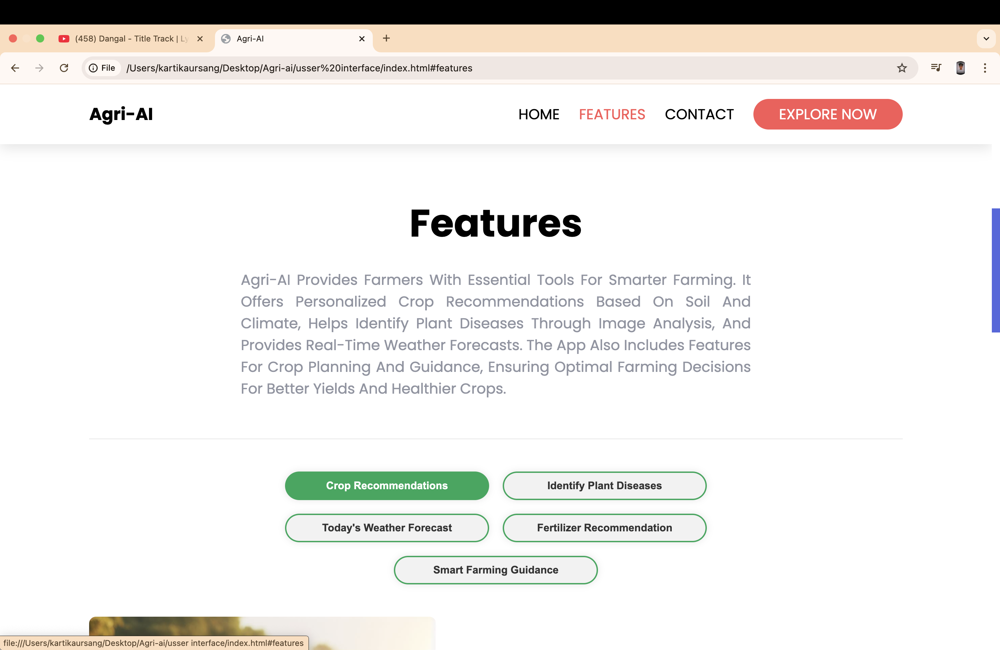
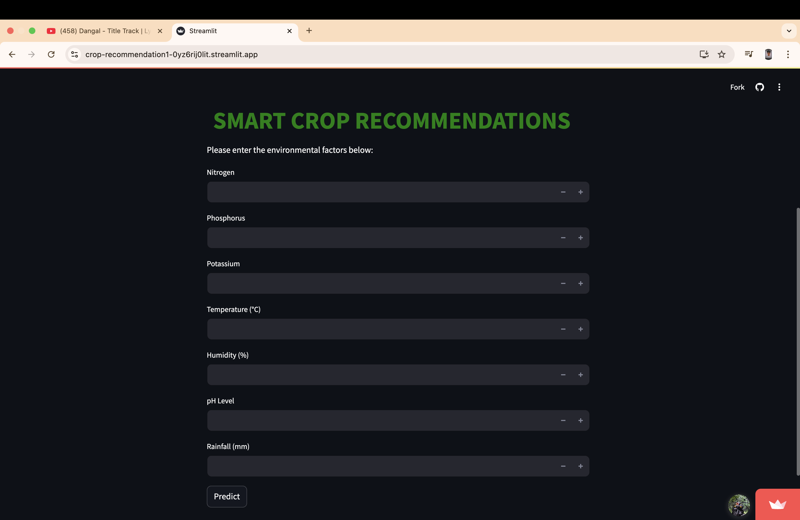
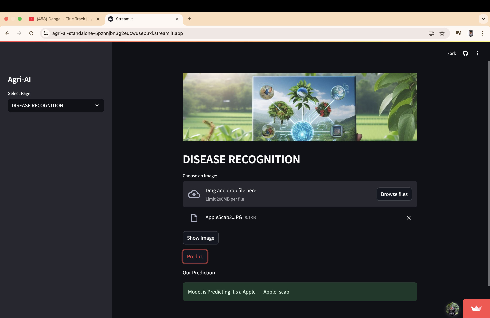
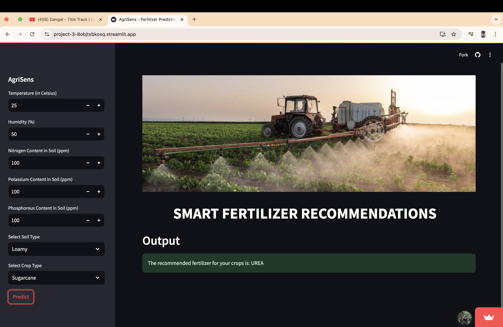
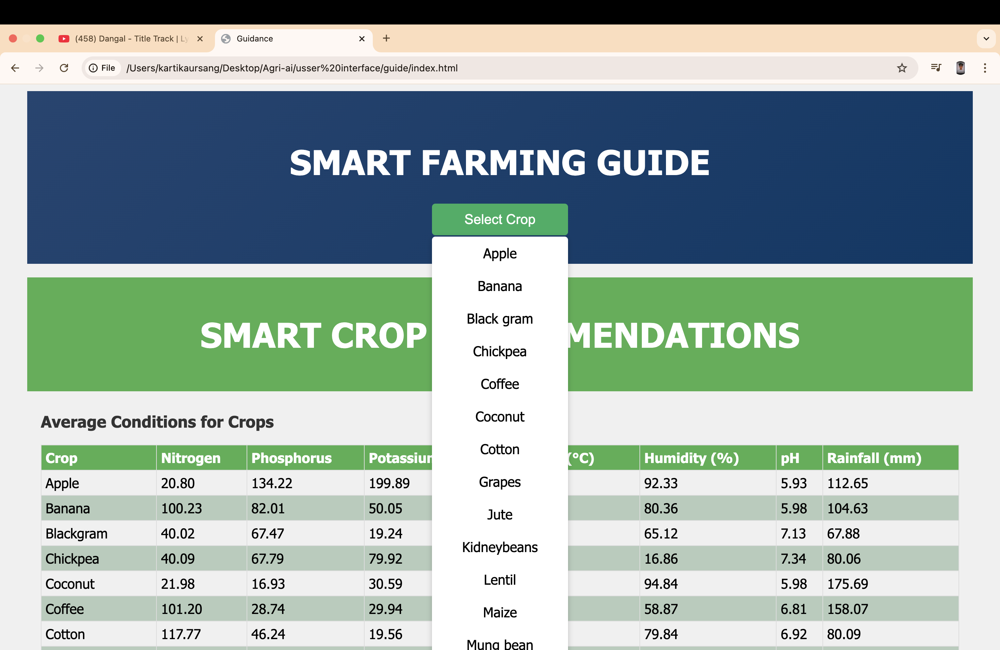

# Agri-AI: Your Smart Farming Assistant

Agri-AI integrates advanced machine learning to enhance farming practices through crop recommendation, disease detection, fertilizer guidance, weather forecasting, and smart farming tips. It empowers farmers with data-driven insights for sustainable agriculture.

## Features

### 1. **Crop Disease Detection**
- Uses a **CNN model** to detect plant diseases from images.
- Provides disease name and treatment suggestions.

### 2. **Fertilizer Recommendation**
- Recommends fertilizers based on soil nutrients (N, P, K).
- Enhances crop yield and soil health.

### 3. **Smart Crop Recommendation**
- Predicts suitable crops using a **Random Forest model** (99.55% accuracy).
- Considers soil and environmental factors like pH, temperature, and rainfall.

### 4. **Weather Forecasting**
- Delivers real-time weather updates for better farming decisions.

### 5. **Smart Farming Guidance**
- Offers practical tips for efficient and sustainable farming.

---

## Usage

- **Crop Recommendation**: Input parameters to get crop suggestions.
- **Disease Detection**: Upload plant images to identify diseases.
- **Fertilizer Guidance**: Enter soil data for fertilizer advice.
- **Weather Updates**: Check forecasts for planning.
- **Farming Tips**: Access expert recommendations.

---
## Technologies Used

- **Machine Learning**: TensorFlow, Scikit-learn  
- **Web Framework**: Streamlit  
- **APIs**: Google Maps API, Weather API  
- **Frontend**: HTML, CSS, JavaScript  

---

# SCREENSHOTS:

## 1. Home Page  
*Description*: The home page introduces Agri-AI with a user-friendly interface. It provides navigation to various features like Crop Recommendation, Disease Detection, Fertilizer Guidance, Weather Updates, and Smart Farming Tips.  

## 2. Features Page  
*Description*: The features page provides an overview of all the tools available in the Agri-AI platform. Users can explore the functionalities such as crop disease detection, fertilizer recommendations, weather forecasting, and more.  

## 3. Crop Recommendation  
*Description*: The crop recommendation feature allows users to input soil and environmental factors. The model predicts suitable crops based on this data, helping farmers choose the best crops for their conditions.  

## 4. Crop Disease Detection  
*Description*: Crop disease detection uses a CNN model to analyze plant images. Users can upload a picture of their plant to receive instant predictions and suggested treatments for detected diseases.  

## 5. Fertilizer Recommendation  
*Description*: The fertilizer recommendation feature provides tailored advice based on soil nutrient levels (N, P, K). This helps farmers optimize their fertilizer use to boost crop yield and soil health.  

## 6. Weather Forecasting  
*Description*: Real-time weather forecasting is integrated into Agri-AI, providing updates that help farmers make informed decisions on irrigation, planting, and harvesting schedules.  

## 7. Smart Farming Guidance  
*Description*: The smart farming guidance feature provides practical tips on efficient and sustainable farming practices. It includes advice on soil management, pest control, crop rotation, and more.  

